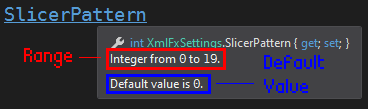

# LoopstationXml

This project contains the helpers required to write/serialize and read/deserialize the Loopstation
RC-505 XML files (*SYSTEM.RC0* and *MEMORY.RC0*).

Usage:

```csharp
using Loopstation.Xml;

namespace ConsoleApp
{
	class Program
	{
		public static void main(string[] args)
		{
			// SYSTEM.RC0
			// Read/deserialize
			XmlSystemFile systemFile = LoopstationXml.Deserialize("./path/to/" + XmlSystemFile.FILE_NAME);
			// Write/serialize
			LoopstationXml.Serialize(systemFile, "./path/to/new/" + XmlSystemFile.FILE_NAME);

			// MEMORY.RC0
			// Read/deserialize
			XmlMemoryFile memoryFile = LoopstationXml.Deserialize("./path/to/" + XmlMemoryFile.FILE_NAME);
			// Write/serialize
			LoopstationXml.Serialize(memoryFile, "./path/to/new/" + XmlMemoryFile.FILE_NAME);
		}
	}
}
```

**All values** are **integers**. If you want better model representation with actual enums,
see [LoopstationModel](https://github.com/wRadion/loopstation_editor/tree/master/LoopstationModel).

Then you can access any properties from the `XmlSystemFile` and `XmlMemoryFile` objects
as you would expect:

```csharp
// Get/set the Master Level property of the memory entry 42
// This is base 0 but the Loopstation is base 1:
// This entry is displayed as the entry #43 on the Loopstation
memoryFile.Memories[42].Master.Level;

// Get/set the LCD Contrast property of the Loopstation system
systemFile.Setup.LcdContrast;

...
```

Whenever you set a property value, it ensures that the given value is inside the possible value range for
the property:

```csharp
// Good ✔
// Sets the SlicerPattern value to 7 (P08) for the INPUT_FX1 in the Memory entry 67.
memoryFile.Memories[67].InputFx1.SlicerPattern = 7;

// Bad ❌
// Throws a ValueOutRangeException because the value is not inside the possible value range (0 = P01 to 19 = P20)
memoryFile.Memories[67].InputFx1.SlicerPattern = 42;
```

There is documentation comments for every properties that indicates the property value range
and its default value:

<p align="center">
	
</p>
